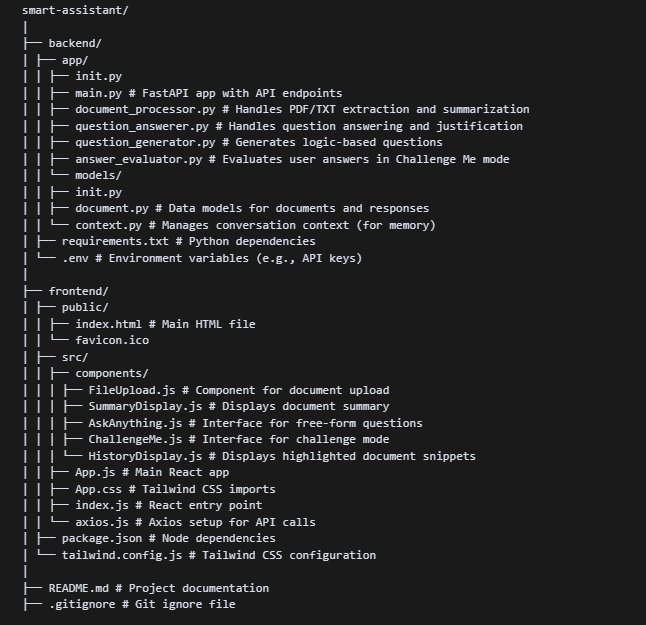

# 📚 Smart Assistant for Research Summarization

A smart assistant that enables researchers to:

* Upload PDF/TXT documents
* Get concise summaries
* Ask intelligent questions
* Test their understanding with challenge-based logic questions

Powered by **FastAPI**, **React**, **Google Gemini API**, and **FAISS**.

---

## 📁 Project Structure

<!--  -->

```
smart-assistant/
│
├── backend/
│   ├── app/
│   │   ├── main.py                # FastAPI app with API endpoints
│   │   ├── document_processor.py  # PDF/TXT extraction and summarization
│   │   ├── question_answerer.py   # Q&A and justification logic
│   │   ├── question_generator.py  # Generates challenge questions
│   │   ├── answer_evaluator.py    # Evaluates user answers
│   │   └── models/
│   │       ├── document.py        # Data models for documents
│   │       └── context.py         # In-memory context manager
│   ├── requirements.txt           # Python dependencies
│   └── .env                       # API keys and environment variables
│
├── frontend/
│   ├── public/
│   │   ├── index.html             # HTML template
│   ├── src/
│   │   ├── components/
│   │   │   ├── FileUpload.js
│   │   │   ├── SummaryDisplay.js
│   │   │   ├── AskAnything.js
│   │   │   ├── ChallengeMe.js
│   │   │   └── HistoryDisplay.js
│   │   ├── App.js
│   │   ├── App.css
│   │   └── axios.js               # Axios API config
│   ├── package.json               # Node dependencies
│   └── tailwind.config.js         # Tailwind CSS config
```

---

## 🧰 Installation & Setup

### 🔧 Backend

```bash
cd backend
python -m venv venv_name
.\venv_name\Scripts\activate   # For Windows
pip install -r requirements.txt
```

> 💡 Create a `.env` file and add your Gemini API key:

```
GOOGLE_API_KEY=your_google_api_key
```

### 💻 Frontend

```bash
cd frontend
npm install
if npm install not work use:-
npm install --legacy-peer-deps
```

---

## ▶️ Running the Project

### Start Backend

```bash
python -m app.main
```

Runs on [http://localhost:8000](http://localhost:8000)

### Start Frontend

```bash
npm start
```

Runs on [http://localhost:3000](http://localhost:3000) or [http://localhost:5000](http://localhost:5000)

---

## 💡 Features

### ✅ Q\&A Chatbot

Ask any question about the uploaded research paper. The system responds with an answer and a justification, using vector search and Gemini model.

### 🎯 Challenge Mode

Tests your understanding by asking three logic-based questions. You provide answers, and the model evaluates them with justifications.

---

## 🔄 Data Flow Overview

### 1. User Interaction (Frontend)

* React app initialized at `/`.
* `FileUpload.js` allows user to upload PDF/TXT.

### 2. File Upload (Frontend → Backend)

* POST to `/upload`
* File processed in `document_processor.py` → text & summary generated.
* Backend response: `{ text, summary }`

### 3. Summary Display (Frontend)

* Summary shown via `SummaryDisplay.js`.
* User can toggle to:

  * Q\&A mode (`AskAnything.js`)
  * Challenge mode (`ChallengeMe.js`)

### 4. Ask Questions (Frontend → Backend)

* POST to `/ask` with `{ question }`
* `question_answerer.py`:

  * Splits document into chunks
  * Uses FAISS + HuggingFaceEmbeddings
  * Builds prompt
  * Calls Gemini API
* Returns: `{ question, answer, justification }`

### 5. Display Response (Frontend)

* Answer displayed along with justification
* Stored in session history using `ContextManager`
* Rendered using `HistoryDisplay.js`

### 6. Challenge Me Mode

* GET `/challenge` returns 3 logic questions
* User answers sent to `/evaluate`
* Evaluated using `answer_evaluator.py`

---

## 🔌 Technologies Used

* **Frontend:** React, CSS, Axios
* **Backend:** FastAPI, LangChain, Google Generative AI (Gemini)
* **Embedding & Retrieval:** HuggingFace (MiniLM), FAISS
* **Data Flow:** JSON over HTTP API

